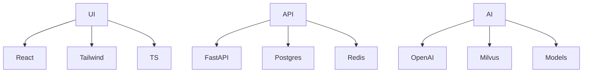

# Welcome to Gain.Energy

Empowering the future of oil and gas engineering through advanced artificial intelligence and cutting-edge technology solutions.

## 🌟 About Us

Gain.Energy is developing next-generation AI tools and platforms specifically designed for oil and gas engineering professionals. Our mission is to enhance engineering workflows, improve decision-making processes, and drive operational efficiency through innovative technology solutions.

## 🛠️ Our Solutions

### Upstrima Platform
An enterprise-grade AI platform built for oil and gas engineering:
- **AI Assistants**: Domain-specific AI models trained on engineering data
- **Knowledge Integration**: Advanced RAG system for technical documentation
- **Workflow Automation**: Streamlined engineering calculations and processes
- **Real-time Collaboration**: Team-based workspaces and communication tools

## 💻 Technology Stack

## 🤝 Working with Us

### For Engineers
- Access enterprise-grade AI tools designed for your workflow
- Collaborate with team members in real-time
- Automate repetitive calculations and processes
- Make data-driven decisions with confidence

### For Organizations
- Deploy secure, scalable AI solutions
- Integrate with existing engineering tools
- Customize workflows to match your processes
- Access comprehensive support and training

### For Developers
- Contribute to open-source components
- Build integrations and plugins
- Access our developer documentation
- Join our technical community

## 📚 Resources

- [Documentation](https://docs.gain.energy)
- [API Reference](https://api.gain.energy)
- [Developer Portal](https://developers.gain.energy)
- [Technical Blog](https://blog.gain.energy)

## 🔒 Security

Security is our top priority. We follow industry best practices:
- SOC 2 Type II compliant
- Regular security audits
- Encrypted data storage
- Role-based access control

Report security concerns to: security@gain.energy

## 📫 Connect with Us

- **Website**: [gain.energy](https://gain.energy)
- **Email**: contact@gain.energy
- **LinkedIn**: [Gain.Energy](https://linkedin.com/company/gain-energy)
- **Twitter**: [@GainEnergy](https://twitter.com/GainEnergy)

## 🌐 Global Presence

<table>
<tr>
<td align="center">
🇺🇸 Houston
 
</td>
<td align="center">
🇺🇸 Memphis
 
</td>
<td align="center">
🇺🇸 Denver
 
</td>
<td align="center">
🇬🇧 London
 
</td>
<td align="center">
🇦🇪 UAE
 
</td>
</tr>
</table>

## 🤝 Join Our Community

We're building the future of oil and gas engineering technology. Join us:
- Follow our repositories
- Contribute to our projects
- Share your feedback
- Join our events and webinars

---

**Gain.Energy** - *Powering Engineering Excellence with AI*

[Terms](https://gain.energy/terms) • [Privacy](https://gain.energy/privacy) • [Status](https://status.gain.energy)

